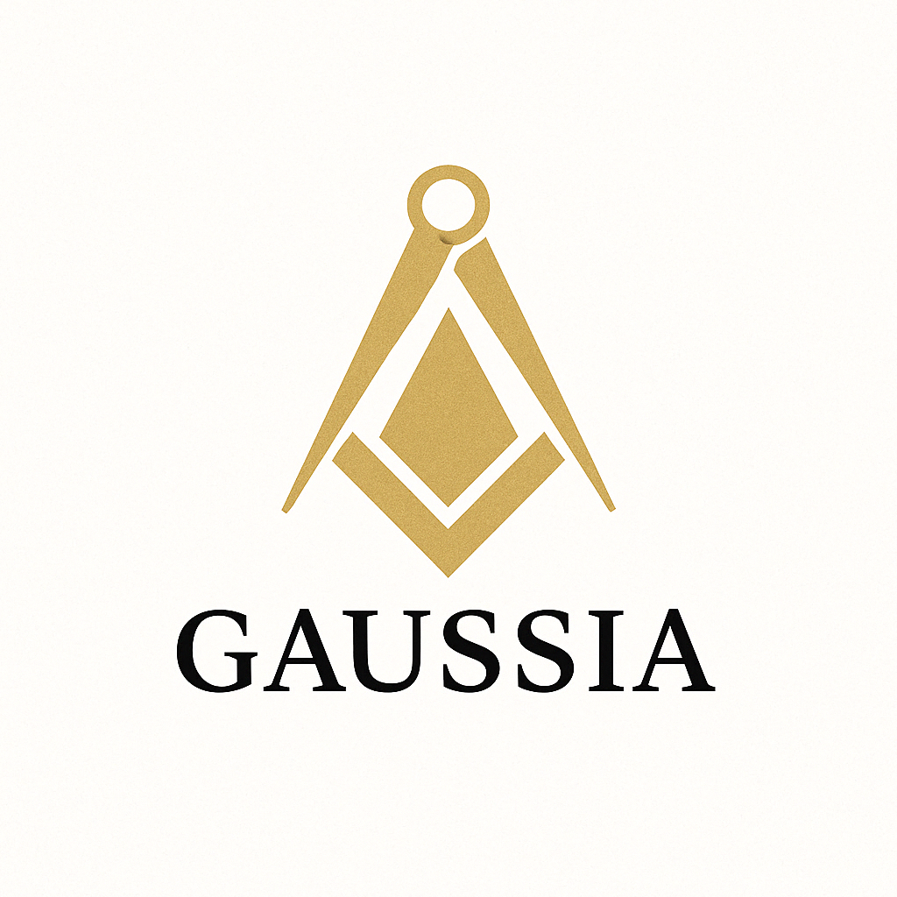

  

# Data, Automation & Cloud Solutions

Avec **Gaussia** ,Libérez le potentiel de vos données. Automatisez. Décidez plus vite.
Expert Data & Automatisation pour entreprises ambitieuses.t.  

## Objectif

Aider les PME, startups et e-commerçants à :
- Exploiter leurs données (BI, dashboards, reporting automatisé)
- Prédire leurs résultats (modèles ML, data science)
- Automatiser leurs process (RPA, no-code, scripts Python)
- Migrer et gérer leurs données dans le cloud (GCP, AWS, Azure)

## Services proposés

 - Dashboards & Reporting Automatisés  
 - Data Science & Prédiction (churn, scoring, NLP)  
 - Cloud Data Engineering
 - Automatisation No-code / Low-code (n8n, Zapier, Make) 
 - RPA & Scripts Python pour tâches récurrentes

## Stack utilisée pour le site

- **React, TypeScript** 
<<<<<<< HEAD
- **HTML / CSS / JS**
- **Hébergé avec GitHub Pages**
=======
- **HTML / TailwindCSS / JS**
>>>>>>> 062504b93f2e0374f886d402e6ae0bd0be1d9a2a

## Voir le site en ligne

🔗 [https://rayane-45.github.io/Gaussia/](https://rayane-45.github.io/Gaussia/)

## Nous contacter

Pour toute mission, projet ou collaboration :
- 📧 
- 💼 [LinkedIn](https://www.linkedin.com/in/ton-lien-linkedin)

